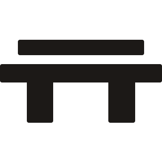

<p align="center"></p>

# Pier

Describe the local services in a project, run `pier up`, and get stable Tailscale URLs for all of them.

Pier is a local Go CLI and TUI over the Tailscale CLI. It reads `pier.yaml`, reconciles those services onto Tailscale Serve (tailnet) and Funnel (public), and prints the URLs. It does not start your apps, implement a tunnel, or reset unrelated Tailscale configuration.

URL availability depends on the developer machine, the local service, and Tailscale remaining online.

## Prerequisites

- Go 1.25+ to build from source
- For tailnet and public URLs: Tailscale installed, running, and signed in. `local:` names need nothing else; when Tailscale is unavailable, `pier up` still serves them and reports Tailscale as skipped
- [MagicDNS](https://tailscale.com/docs/features/magicdns) and [HTTPS certificates](https://tailscale.com/docs/features/https) enabled for Serve
- [Funnel](https://tailscale.com/docs/features/tailscale-funnel) authorization on the device if any service uses `public: true`

See [Tailscale Serve](https://tailscale.com/docs/features/tailscale-serve) and [Tailscale Funnel](https://tailscale.com/docs/features/tailscale-funnel) for current platform requirements.

## Install

macOS or Linux:

```bash
curl -fsSL https://raw.githubusercontent.com/Bethel-nz/pier/main/scripts/install.sh | bash
```

Windows PowerShell:

```powershell
irm https://raw.githubusercontent.com/Bethel-nz/pier/main/scripts/install.ps1 | iex
```

The installers download the latest GitHub release, verify its SHA-256 checksum, and install Pier into a user-owned binary directory. Use `PIER_VERSION` to install a specific release or `PIER_INSTALL_DIR` to choose another destination.

From anywhere, with Go:

```bash
go install github.com/Bethel-nz/pier/cmd/pier@latest
```

From a source checkout:

```bash
go install ./cmd/pier
```

Either command puts `pier` in `$(go env GOPATH)/bin` (or `GOBIN` if set). Add that directory to your `PATH`.

## Quick start

```bash
pier init
pier validate
pier plan
pier up
pier status
pier
pier down
```

`pier` with no arguments opens the TUI when stdin and stdout are terminals. Otherwise it prints help. `pier tui` is the explicit alias.

## Example `pier.yaml`

```yaml
version: 1
name: greppa

defaults:
  public: false
  protocol: http

services:
  web:
    target: localhost:3000
    path: /

  api:
    target: localhost:4000
    path: /api

  webhook:
    target: localhost:8787
    path: /hooks
    public: true
```

`public: false` maps to Serve on HTTPS listener `8443`. `public: true` maps to Funnel on HTTPS listener `443`. Serve and Funnel never share a listener.

## Local names

Give a service a `local` name ending in `.local`, and `pier up` serves it over HTTPS to this machine and every phone, tablet, and laptop on the same network:

```yaml
services:
  web:
    target: localhost:3000
    local: myapp.local
```

```
local  web  https://myapp.local/
```

Nothing else to install. On `pier up`, Pier:

- issues a certificate into `.pier/certs/` from a local CA that can only sign `.local` names (and adds `.pier/` to `.gitignore`),
- asks the OS once to trust that CA (the macOS password dialog, a Windows confirmation, or `sudo` on Linux),
- starts a small background daemon that answers mDNS for the names and proxies HTTPS on port 443 to your service, which stays bound to loopback.

The daemon answers with this machine's address on the asking device's own network, so a Wi-Fi change needs nothing from you. `pier pause` withdraws one name, `pier down` withdraws the project's names, and the daemon exits once no project declares a local name. The Tailscale URL is unchanged.

To trust HTTPS on another device, open `http://<local-name>/.pier/` on it once (or scan `pier qr --ca`). The page detects the device and gives it a one-tap installer: a profile on iPhone and iPad, a certificate on Android, Windows, and other computers. Trust lasts for every `.local` name Pier serves, so each device does this only once. Compare the fingerprint the page shows with `pier doctor`.

On Linux, binding port 443 needs `sudo setcap cap_net_bind_service=+ep "$(command -v pier)"`. Without it, Pier uses port 8443 and says so. Chrome and Firefox on Linux read their own certificate stores; Pier adds its CA there when NSS's `certutil` is installed.

A `local` name makes that service reachable by anyone on the same network. Use it on networks you trust.

A longer copy lives in [`pier.example.yaml`](pier.example.yaml). Configuration details are in [`docs/configuration.md`](docs/configuration.md).

### Gotchas

Hit in real testing. Details in [`docs/troubleshooting.md`](docs/troubleshooting.md).

- **Another device can't resolve `.local`.** Turn IPv6 on for both that device and the machine running Pier. Many home routers drop IPv4 multicast between Wi-Fi clients but pass IPv6.
  - Windows: `Enable-NetAdapterBinding -Name "Wi-Fi" -ComponentID ms_tcpip6`, then `ipconfig /flushdns`.
  - macOS: System Settings → Wi-Fi → Details → TCP/IP → Configure IPv6: Automatically.
  - Linux: `sysctl net.ipv6.conf.all.disable_ipv6` should print `0`.
  - Phones: on by default.
- **Windows network set to Public.** The firewall drops incoming mDNS replies. Run `Set-NetConnectionProfile -InterfaceAlias "Wi-Fi" -NetworkCategory Private`.
- **`ping <mac-name>.local` works but the Pier name doesn't.** Windows resolved the Mac's name over NetBIOS, not mDNS, so it proves nothing. Test with `ping myapp.local`.
- **Chrome on iPhone can't resolve `.local`, Safari can.** Use Safari, or turn off Secure DNS in Chrome's settings.
- **Certificate warning on phones and other machines.** `pier trust` covers only this machine. Open `http://myapp.local/.pier/` on the device (or scan `pier qr --ca`) and follow its steps.
- **The URL has `:8443`.** Tailscale Serve or Funnel holds port 443, so Pier shares it by binding its LAN addresses, or falls back to 8443. Old Serve and Funnel routes, possibly public ones, stay until you run `pier down` with Tailscale running.
- **`pier: command not found` after `go install`.** Add `$(go env GOPATH)/bin` to your `PATH`.
- **Changes don't take effect in the daemon.** It keeps the environment it started with. After changing permissions or reinstalling, run `pier down && pier up` from the terminal you normally use.

## Configuration examples

- [`examples/configs/basic.yaml`](examples/configs/basic.yaml) — one private HTTP service.
- [`examples/configs/multiple-services.yaml`](examples/configs/multiple-services.yaml) — several private services on separate paths, including an HTTPS upstream.
- [`examples/configs/public-webhook.yaml`](examples/configs/public-webhook.yaml) — a private app with one public Funnel webhook.
- [`examples/configs/local-domains.yaml`](examples/configs/local-domains.yaml) — `.local` HTTPS names for devices on the same network.
- [`examples/bun-server/`](examples/bun-server/) — a runnable Bun server demo with its own `pier.yaml`.

## CLI

| Command | What it does |
| --- | --- |
| `pier agents [--write]` | Print an agent-ready Pier setup prompt, or write it to `AGENTS.md` |
| `pier init [name]` | Create a minimal `pier.yaml` and `.pier/id` |
| `pier validate` | Schema and semantic checks without requiring services to run |
| `pier plan` | Print the non-mutating desired-versus-actual plan |
| `pier up` | Start `run:` commands, then validate, check Tailscale, plan, apply, verify, persist ownership, print URLs |
| `pier down` | Remove only routes owned by this Pier project |
| `pier status [--all]` | Show what Tailscale actually serves for each service, how long anything has been PUBLIC, and what differs from `pier.yaml`; `--all` lists every route on this machine |
| `pier doctor` | Diagnose config, Tailscale, and local targets |
| `pier share <service>` | Runtime-only `public: true` override |
| `pier unshare <service>` | Remove the override and restore configured access |
| `pier pause <service>` | Remove that service's Tailscale route; the local process stays running |
| `pier resume <service>` | Restore a paused service route |
| `pier service add [name]` | Add a service to `pier.yaml` (Huh form in a TTY, or `--target`) |
| `pier open <service> [--local]` | Open the current Tailscale URL, or the `.local` URL |
| `pier copy <service> [--local]` | Copy the current Tailscale URL, or the `.local` URL |
| `pier trust [--remove]` | Trust Pier's local CA again, or remove it (`pier up` trusts it for you) |
| `pier replay [id...]` | List requests kept by `capture:`, or send them to the service again (`--since 10m`, `--show`) |
| `pier` / `pier tui` | Interactive management interface |

Global flags: `--config`, `--json`, `--verbose`, `--no-color`.

- `pier up --strict` refuses to apply if a local target is unavailable. Without `--strict`, unavailable targets are reported and still configured.
- `pier up --force` and `pier plan --force` take over unmanaged Tailscale routes on the same listener and path.
- `--json` is supported for `validate`, `plan`, `status`, and `doctor` (and the other commands). The envelope is `{version, command, project, data, warnings, errors}` with schema version `1`.
- `--verbose` includes raw Tailscale stderr. Human-readable errors always lead with a Pier explanation.

## TUI keys

```
↑/↓ select   a add   space pause/resume
u up         d down  p plan   s share/unshare
c copy       o open  r refresh  ? help   q quit
```

Deletes and unmanaged-route takeovers ask for confirmation. `q` does not quit while a confirmation modal is open.

## Public exposure

`public: true` and `pier share` publish a path on the internet through Funnel. Anyone who can reach the Funnel URL can reach that local service. Tailscale still owns TLS, DNS, and Funnel policy; Pier only asks Tailscale to configure the path.

## Safety

Pier never runs `tailscale serve reset` or `tailscale funnel reset`. `pier down` removes only routes this project recorded as owned. Unrelated Tailscale routes are left untouched unless you pass `--force` to take over a conflicting path. Details: [`docs/troubleshooting.md`](docs/troubleshooting.md).

## Remove Pier routes

```bash
pier down
```

Then delete `pier.yaml` and `.pier/` if you no longer want the project. Runtime ownership state lives under the OS user config directory (`<user-config-dir>/pier/projects/<project-id>.json`) and is not committed.

## Verify

CI runs `gofmt`, `go vet ./...`, and `go test ./...`. Tailscale is not required in CI.

Local checks:

```bash
gofmt -w .
go vet ./...
go test ./...
./scripts/smoke.sh
```

`./scripts/smoke.sh` starts two loopback HTTP servers, writes a temporary `pier.yaml`, and runs `pier validate` and `pier plan`. It does not change Tailscale routes unless you set `PIER_SMOKE_APPLY=1`.

```bash
PIER_SMOKE_APPLY=1 ./scripts/smoke.sh
```

That apply path needs a disposable Tailscale node authorized for Serve (and Funnel if you add public routes). `pier down` runs in a trap and the script checks that unrelated Tailscale routes are unchanged.

Do not tag `v0.1.0` until that live run and a TUI pass have been done on a real node.

## License

Pier is available under the [MIT License](LICENSE).
